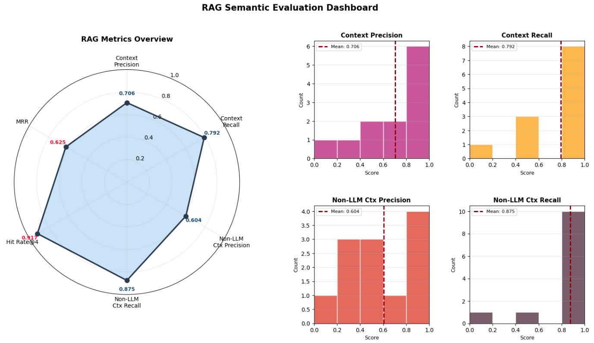
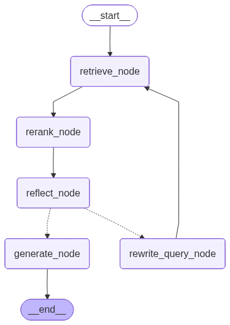
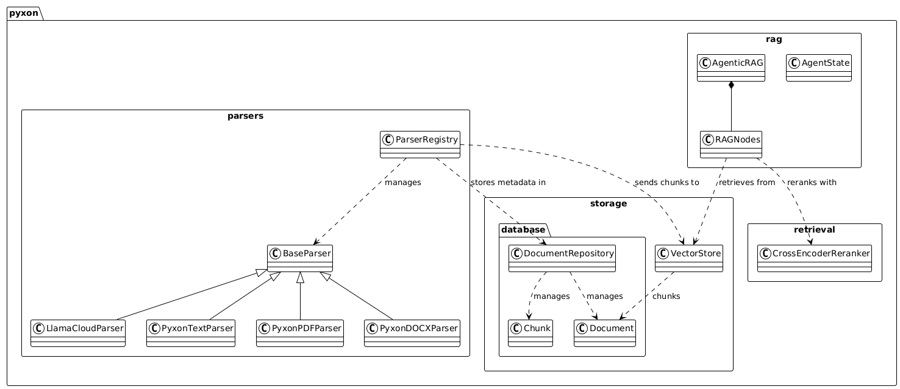

# Pyxon AI - Document Intelligence Platform

A production-grade Retrieval-Augmented Generation (RAG) system for intelligent document analysis with self-reflective retrieval and cross-encoder reranking.

**Live Demo:** [Try Pyxon AI](https://ahmad-alqaisi215-pyxon-ai-entry-task-main-dev-ektxza.streamlit.app/)

---

## Performance Metrics



### Key Results

| Metric | Score | Description |
|--------|-------|-------------|
| **Hit Rate** | 0.917 | Top-K retrieval accuracy |
| **Context Recall** | 0.792 | Relevant context retrieval |
| **Context Precision** | 0.706 | Retrieved context relevance |
| **Non-LLM Ctx Recall** | 0.875 | Pre-rerank recall |
| **MRR** | 0.625 | Mean reciprocal rank |
| **Non-LLM Ctx Precision** | 0.604 | Pre-rerank precision |

[View Full Evaluation Report →](tests/rageval.ipynb)

---

## Architecture Overview

### RAG Workflow Pipeline

<p align="center">
  
</p>

The system implements a self-reflective RAG workflow with iterative query refinement. Starting from document retrieval, results pass through reranking and reflection stages before answer generation. Failed reflection triggers query rewriting for improved results.

### Component Architecture


The AgenticRAG orchestrator coordinates specialized workflow nodes:

- **Retrieve Node**: Semantic search with metadata filtering
- **Rerank Node**: Cross-encoder scoring for precision
- **Reflect Node**: Answer quality critique
- **Generate Node**: LLM-powered answer synthesis
- **Rewrite Node**: Query optimization for better retrieval

### System Design



Modular architecture separating concerns across parsers, storage, and retrieval layers. Multiple parser implementations (PDF, DOCX, text, LlamaCloud) feed into a unified document repository with dual storage (vector + SQL) and cross-encoder reranking.

---

## Core Features

**Adaptive Chunking**  
Automatic selection between fixed-size and semantic chunking based on document structure analysis (coefficient of variation threshold: 0.2).

**Cross-Encoder Reranking**  
Second-stage scoring using `cross-encoder/ms-marco-MiniLM-L-6-v2` for improved precision beyond initial vector similarity.

**Self-Reflective RAG**  
Iterative query refinement with agentic reflection (max 6 iterations). Failed reflections trigger automatic query rewriting.

**Multi-Language Support**  
Full Arabic and English support via OpenAI `text-embedding-3-large` (1024 dimensions).

**Dual Storage Architecture**  
Vector database (Pinecone) for semantic search combined with SQL (SQLite) for metadata management and structured queries.

---

## Quick Start

### Installation

```bash
# Clone repository
git clone https://github.com/ahmad-alqaisi215/pyxon-ai-entry-task
cd pyxon-ai-entry-task

# Install dependencies
uv sync

# Configure environment
cp .env.example .env
# Edit .env and add: OPENAI_API_KEY, PINECONE_API_KEY, GROQ_API_KEY
```

### Database Setup

```bash
# Run migrations
alembic upgrade head
```

### Run Application

```bash
# Start web interface
streamlit run main.py
```

---

## Tech Stack

**Language Models**
- LLM: Llama 3.3 70B (Groq)
- Embeddings: OpenAI `text-embedding-3-large` (1024 dims)
- Reranker: `cross-encoder/ms-marco-MiniLM-L-6-v2`

**Storage**
- Vector DB: Pinecone
- SQL DB: SQLite + SQLAlchemy + Alembic

**Frameworks**
- Backend: LangChain + LangGraph
- Frontend: Streamlit

**Supported Formats**
- PDF (`.pdf`)
- Word Documents (`.docx`, `.doc`)
- Text Files (`.txt`)

---

## Configuration

Key parameters in `src/config.py`:

```python
CHUNK_OVERLAP = 0.2           # Overlap ratio for chunking
TOP_K = 5                     # Initial retrieval count
MAX_RAG_ITERATIONS = 6        # Max reflection cycles
PERCENTILE_THRESH = 0.9       # Reranking threshold
```

---

## Project Structure

```
.
├── src/
│   ├── pyxon/
│   │   ├── parsers/          # Document parsing (PDF, DOCX, TXT)
│   │   ├── rag/              # RAG workflow nodes
│   │   ├── retrieval/        # Reranking logic
│   │   └── storage/          # Vector & SQL storage
│   └── config.py             # System configuration
├── main.py                   # Streamlit application
├── tests/
│   └── rageval.ipynb         # Evaluation notebook
└── data/                     # Database & test files
```

---

## Design Decisions

### Why This Approach?

**Graph RAG** requires domain-specific entity extraction, making it fragile for mixed document types (forms, contracts, notes, reports).

**RAPTOR** assumes hierarchical document structure that doesn't exist in many real-world documents.

**Hybrid Vector + Reranking** handles multi-domain semantic drift better while maintaining flexibility across document types.

### Chunking Strategy

Automatic selection based on paragraph length variation:

- Calculate coefficient of variation across paragraphs
- Use semantic chunking if variation > 0.2
- Use fixed-size chunking for uniform documents
- Adapts to document structure without manual configuration

---

Made with ❤️ by Ahmad Alqaisi